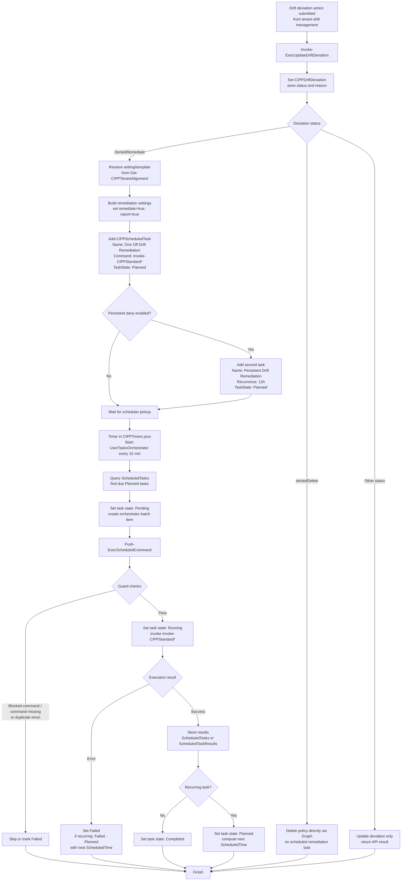

# Drift Remediation Task Flow

This document visualizes how a Drift Remediation task is created and executed in CIPP-API.

## Flow Chart

## Source Path

1. Drift decision endpoint and remediation task creation:
   - Modules/CIPPHTTP/Public/Entrypoints/HTTP Functions/Tenant/Standards/Invoke-ExecUpdateDriftDeviation.ps1
2. Scheduled task creation and persistence:
   - Modules/CIPPCore/Public/Add-CIPPScheduledTask.ps1
3. Scheduler cadence:
   - Config/CIPPTimers.json
4. Scheduled task pickup and orchestration:
   - Modules/CIPPCore/Public/Entrypoints/Orchestrator Functions/Start-UserTasksOrchestrator.ps1
5. Scheduled command execution and state transitions:
   - Modules/CIPPActivityTriggers/Public/Entrypoints/Activity Triggers/Push-ExecScheduledCommand.ps1
